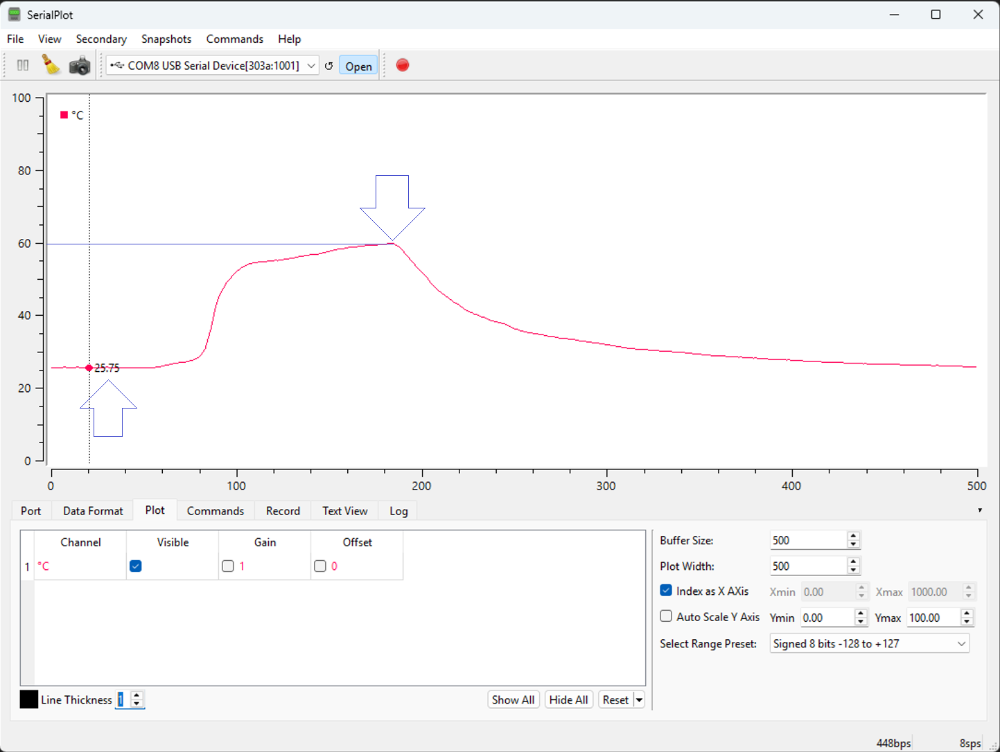

# LMT01 Temperature Sensor Library (ESP32 + Arduino)

An Arduino-compatible library for the **ESP32** platform that interfaces with the Texas Instruments **LMT01** digital temperature sensor using a **pulse-counting** method and hardware timer.

## Key Features

- Works with ESP32 (Arduino framework)
- No analog pins required — digital pulses are counted instead
- Hardware timer-based measurement window
- Temperature output in Celsius

## Basic Usage

```cpp
#include "LMT01.h"

LMT01 sensor(LMT01_PULSES_PIN, LMT01_PWR_PIN, 130); // 130ms window

void setup() {
    Serial.begin(19200);
    sensor.begin();
}

void loop() {
    if (sensor.ready()) {
        float temp = sensor.read();
        Serial.printf("%.2f %cC\n", temp, 176);
    }
}
```

> Note: This library is designed specifically for ESP32 boards using the Arduino framework. It uses hw_timer_t and attachInterrupt for reliable pulse measurement.

## Basic Circuit


## Serial Terminal Output


# Concepts ([Datasheet](assets/LMT01.pdf))
## Time Window Definition


## Transfer Function
The output transfer function is approximately linear and can be expressed as:

$$
\text{Temp} = \left( \frac{\text{PC}}{4096} \times 256^\circ\text{C} \right) - 50^\circ\text{C}
$$

Where:
- **PC** is the number of pulses counted within the defined time window.
- **Temp** is the resulting temperature in degrees Celsius.

## Compatibility
This library was tested with:

- **ESP32 Arduino Core v3.2.0**  
  Based on **ESP-IDF v5.4.1**  
  🔗 [GitHub Release: espressif/arduino-esp32 v3.2.0](https://github.com/espressif/arduino-esp32/releases/tag/3.2.0)

> For best results, ensure you are using this version or later of the ESP32 Arduino core.
